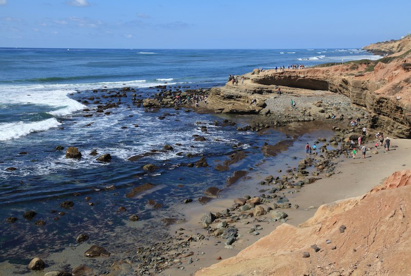

# FEWD-a01
FEWD assignment 1

## Hi!  My name is _Andy_.  
_Once upon a time_, I lived in the Midwest.  I had a work assignment in San Diego in February, a long, long, long time ago.  When I got off the plane and went to the parking lot, I realized there was an escalator with very little protection from the weather.  I got _goosebumps_.  I spent six weeks in San Diego and decided one day I would move here.

### My _**Offspring**_
Three of them beat me to **SoCal**, but none of those were smart enough to move to San Diego.  Instead they live in LA.  I think it is just about the right distance.  Too long to see them everyday, but short enough to be convenient.

* Alexandra
* Brittney
* Andrew
* Padraich

#### Two of many favorite things in San Diego.
There is a lot to do in San Diego.  Two of my favorite things are the Cabrillo National Monument tidepools and Torrey Pines State Park.  Here's a picture of an area with many tidepools: 

You can learn a little bit about Torrey Pines [here](https://torreypine.org/)
